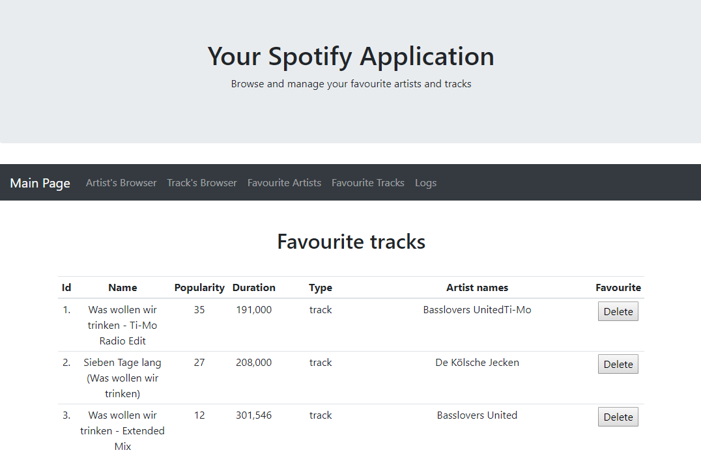

# YourSpotifyApplication
> The application has been created as a tool letting a user managing his/her favorite tracks and artists.

## Table of contents
* [General info](#general-info)
* [Features](#features)
* [Technologies](#technologies)
* [Status](#status)
* [Inspiration](#inspiration)
* [Contact](#contact)

## General info
> The main features of this application are the possibility to search and manage the user's favorite tracks and artists. These opportunities are achieved due to using the Spotify API.
  
## Features

### Artist Search
> After typing a phrase and push the "Search by name" button, the app would connect with proper, genuine REST Spotify service. Artist items that are matched to the phrase are shown a table. Every record could be added/removed from the favorite list. 
 
### Track Search
> After typing a phrase and push the "Search by name" button, the app would connect with proper, genuine REST Spotify service. Track items that are matched to the phrase are shown a table. Every record could be added/removed from the favorite list.
 
### Favorite Artists
> In favorite artists tab the user is allowed to preview artists which have been already added to the repository. Moreover, the user can remove an artist from a favorite.
 
### Favourite Tracks
> In favorite tracks tab the user is allowed to preview tracks which have been already added to the repository. Moreover, the user can remove an track from a favorite.
 
### Logs
> An additional feature that lets the user preview a logs form application.
 

## Technologies
* Java SE 11
* Spring Boot 2.2.0
* Spring MVC
* Spring Data JPA 2.2.0
* Hibernate 5.4.4
* Rest API
* H2 (NoSQL database)
* MySQL 8.0.15
* FasterXML/Jackson 2.9.10
* SLF4J 1.7.28
* Maven 3.3.9
* JavaScript
* Freemarker 2.3.29
* Bootstrap 4.3.1
* HTML5, CSS3, JS
* jQuery, AJAX

## Status
Project is: _finished_.

## Inspiration
The project has been being created as an interview task.

## Contact
Creating by [@Marek Sitarski](https://pl.linkedin.com/in/marek-sitarski) - marek_sitarski@vp.pl.
